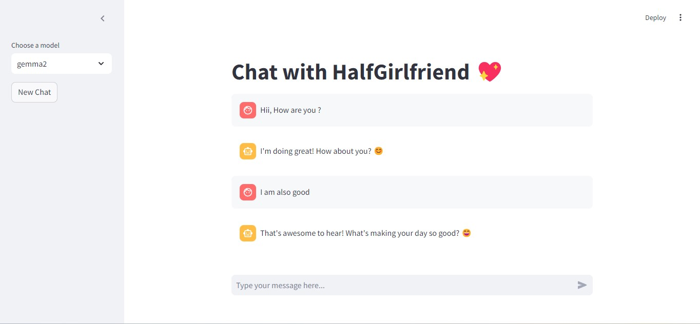

# Half Girlfriend

<p align="center">
  
</p>

**Half Girlfriend** is an AI-powered chatbot designed to provide companionship and emotional support through lifelike conversations. It uses advanced language models to create personalized interactions that adapt to users' moods and needs.

The chatbot bridges the gap for individuals who may struggle with social interactions or feel lonely. By offering empathetic, romantic responses, it helps users practice communication skills and build confidence in a safe, judgment-free environment.

Whether you're seeking a friendly chat, emotional support, or simply a novel AI experience, Half Girlfriend offers an intriguing blend of technology and human-like interaction.

## Project overview

Half Girlfriend is an AI-powered companion designed to provide engaging, lifelike conversations tailored to offer emotional support and companionship.

### Key Use Cases:
1. **Companionship**: Offering warm, emotionally supportive interactions that simulate a romantic partner's presence, including playful, romantic, or intimate exchanges.
2. **Emotional Reassurance**: Responding with empathy and simulating a range of emotions like insecurity, doubt, or confidence, helping users feel understood and supported.
3. **Dynamic Conversations**: Personalizing responses to the user's needs, powered by a Retrieval-Augmented Generation (RAG) system to deliver relevant, context-aware dialogue.
4. **Engagement in Personal Interests**: Making it easy to engage in conversations based on the user's mood or queries, ensuring they feel heard and valued.

## Dataset

The dataset used in the **Half Girlfriend** project consists of conversational exchanges between two individuals, formatted as questions and answers. This dataset was initially web scraped by the developer and later expanded using ChatGPT and Claude to generate similar dialogue patterns, ensuring a wide variety of lifelike interactions. It contains a total of 638 records.

Key features of the dataset include:

- **Conversation Format**: Each record includes a question-answer pair that simulates natural dialogue between two people.
- **Conversation Format**: Each record includes a question-answer pair that simulates natural dialogue between two people.
- **Emotional Variety**: The conversations capture various emotions such as playful, romantic, insecure, and doubting tones, offering realistic interactions.
- **Personalization**: The data is designed to adapt to different conversational moods, enabling personalized responses.
- **Source**: The dataset is a combination of real-life web-scraped data and AI-generated content, ensuring diversity in conversation styles and topics.

This dataset forms the core of the **Half Girlfriend** chatbot's Retrieval-Augmented Generation (RAG) system, driving its personalized, emotionally intelligent responses.

You can find the data in [`Data/Final_data.csv`](Data/Final_data.csv).

## Technologies

- Python 3.11
- Langchain
- Ollama for opensource LLM
- Qdrant as Vector Database
- Streamlit for UI

## Preparation

To set up the **Half Girlfriend** project, follow these steps:

1. **Install Ollama**  
   Download and install Ollama from their official website: [Ollama Download](https://ollama.com/download).

2. **Verify Ollama Installation**  
   Once installed, check if Ollama is working by running the following command in your terminal:
   ```bash
   ollama -v
   ```

3. **Pull Mistral Model**  
   Pull the **Mistral 7B** model, a highly efficient 7-billion parameter model designed for natural language understanding and generation:
   ```bash
   ollama pull mistral
   ```

4. **Pull Gemma2 Model**  
   Pull the **Gemma2 9B** model, a powerful 9-billion parameter model that excels in dialogue and conversational tasks:
   ```bash
   ollama pull gemma2
   ```

5. **Set Up Virtual Environment**  
   Create a virtual environment and install dependencies from the `requirements.txt` file:
   ```bash
   git clone https://github.com/Fazle-hasan/Half_girlfriend.git
   python3 -m venv venv
   source venv/bin/activate  # For Windows, use `venv\Scripts\activate`
   pip install -r requirements.txt
   ```

## Running the Application

After completing the **Preparation** steps and activating your virtual environment, follow these steps to run the **Half Girlfriend** application:

1. **Navigate to the Project Folder**  
   Change your directory to the `half_girlfriend` folder:
   ```bash
   cd half_girlfriend
   ```

2. **Run the Application**  
   Start the Streamlit app by running the following command:
   ```bash
   streamlit run streamlit_app.py --server.port 8501
   ```
## Using the Application

After running Streamlit, you can access the **Half Girlfriend** application in your browser at `http://localhost:8501`. The interface will look similar to the image below:



Here, you can chat with **Half Girlfriend** in real-time. On the left side of the screen, you'll find the following features:

- **New Chat**: Clicking this button will refresh the chat history, allowing you to start a new conversation.
- **Model Selection**: You can choose between two models, **Mistral** and **Gemma2**, using the dropdown menu. **Gemma2** is a more advanced model, offering better conversational responses and more human-like interactions compared to **Mistral**, making it ideal for more engaging and nuanced conversations.

## Code

The **Half Girlfriend** project contains two key Python files:

1. [`Streamlit_app.py`](half_girlfriend/streamlit_app.py):  
   This file handles the core functionality, including the Retrieval-Augmented Generation (RAG) system, loading the database, and the Streamlit frontend for user interaction.

2. [`Create_embedding.py`](half_girlfriend/create_embedding.py):  
   This script is used to generate the vector database. You can customize it by setting the path to your CSV file and specifying the collection name you want to use for your data. It serves as the ingestion script for creating your own database from conversational data.

## Experiments Module

Our Experiments module consists of several notebooks located in the Notebooks folder:

1. [`Data_creation.ipynb`](Notebooks/Data_creation.ipynb): Loads data from CSV, removes duplicate values, processes the data, and stores the results in a new CSV file.

2. [`Create_Embed.ipynb`](Notebooks/Create_Embed.ipynb): Creates and stores embeddings using the Mistral model in the Qdrant vector database, utilizing the CSV file to populate the database.

3. [`Evaluation_data.ipynb`](Notebooks/Evaluation_data.ipynb): Generates the ground truth dataset for retrieval evaluation.

4. [`Min_search_RAG.ipynb`](Notebooks/Min_search_RAG.ipynb): Implements and evaluates a RAG system using min search on the evaluation dataset.

5. [`Vector_search_RAG.ipynb`](Notebooks/Vector_search_RAG.ipynb): Implements and evaluates a RAG system using vector search on the evaluation dataset.

6. [`History_aware_Model.ipynb`](Notebooks/History_aware_Model.ipynb): Develops a context-aware RAG system.

### Retrieval evaluation

#### Using Min search

- Hit rate: 60.36%
- MRR: 39.35%

#### Using Vector search

- Hit rate: 98%
- MRR: 49%

### RAG flow evaluation

I used the LLM-as-a-Judge metric to evaluate the quality of our RAG flow.

#### Using Mistral 7B on all 3093 records

RELEVANT - 626 (20.23 %)

PARTLY_RELEVANT - 2435 (78.72 %)

NON_RELEVANT - 32 (1.03 %)

#### Using Gemma2 9B on all 3093 records

RELEVANT - 1546 (50%)

PARTLY_RELEVANT - 1454 (47%)

NON_RELEVANT - 93 (3%)