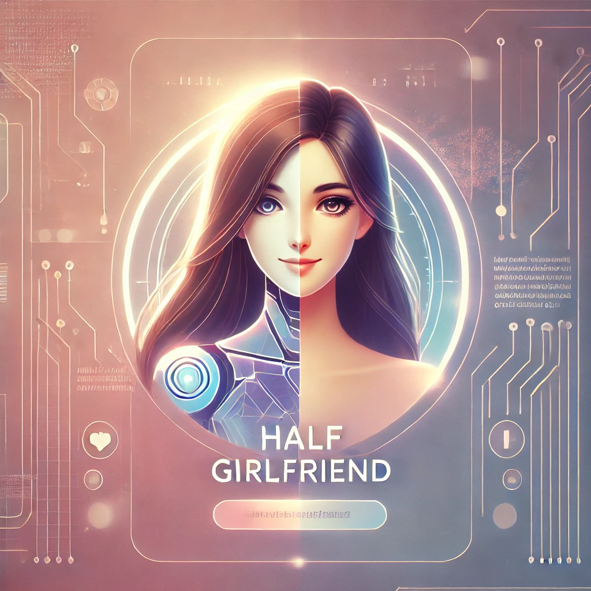

# Half Girlfriend

  

Half Girlfriend is an innovative AI-powered chatbot designed to provide companionship and emotional support through lifelike conversations. This sophisticated virtual companion uses advanced language models to create personalized, engaging interactions that adapt to users' moods and conversational needs.

Half Girlfriend aims to bridge the gap for individuals, particularly those who may struggle with social interactions or experience loneliness, by offering a safe space to express thoughts and feelings. The chatbot's empathetic responses and ability to simulate romantic interest provide users with a unique opportunity to practice communication skills and build confidence in a judgment-free environment. 

Whether you're seeking a friendly chat, emotional support, or simply a novel AI experience, Half Girlfriend offers an intriguing blend of technology and human-like interaction.

## Project overview

Half Girlfriend is an AI-powered companion designed to provide engaging, lifelike conversations tailored to offer emotional support and companionship.

### Key Use Cases:
1. **Companionship**: Offering warm, emotionally supportive interactions that simulate a romantic partner's presence, including playful, romantic, or intimate exchanges.
2. **Emotional Reassurance**: Responding with empathy and simulating a range of emotions like insecurity, doubt, or confidence, helping users feel understood and supported.
3. **Dynamic Conversations**: Personalizing responses to the user's needs, powered by a Retrieval-Augmented Generation (RAG) system to deliver relevant, context-aware dialogue.
4. **Engagement in Personal Interests**: Making it easy to engage in conversations based on the user's mood or queries, ensuring they feel heard and valued.

## Dataset

The dataset used in the **Half Girlfriend** project consists of conversational exchanges between two individuals, formatted as questions and answers. This dataset was initially web scraped by the developer and later expanded using ChatGPT and Claude to generate similar dialogue patterns, ensuring a wide variety of lifelike interactions. It contains a total of 638 records.

Key features of the dataset include:

- **Conversation Format**: Each record includes a question-answer pair that simulates natural dialogue between two people.
- **Emotional Variety**: The conversations capture various emotions such as playful, romantic, insecure, and doubting tones, offering realistic interactions.
- **Personalization**: The data is designed to adapt to different conversational moods, enabling personalized responses.
- **Source**: The dataset is a combination of real-life web-scraped data and AI-generated content, ensuring diversity in conversation styles and topics.

This dataset forms the core of the **Half Girlfriend** chatbot's Retrieval-Augmented Generation (RAG) system, driving its personalized, emotionally intelligent responses.

You can find the data in [`Data/Final_data.csv`](Data/Final_data.csv).

## Technologies

- Python 3.11
- Langchain and Ollama for opensource LLM
- Qdrant for Vector search
- Streamlit for UI